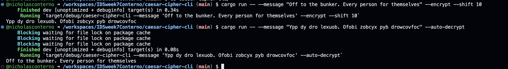

[](https://github.com/nogibjj/IDSweek7Conterno/actions/workflows/tests.yml)
[](https://github.com/nogibjj/IDSweek7Conterno/actions/workflows/lint.yml)
# IDS Week 7 Mini-Project: Caesar Cipher CLI Tool

This command-line tool allows users to encrypt and decrypt messages using the Caesar cipher. Additionally, it features an auto-decryption method based on the frequency of letters in English.
# User Guide
## Installation

Ensure you have Rust and Cargo installed. Clone the repository:

```bash
git clone https://github.com/nogibjj/IDSweek7Conterno/
cd caesar-cipher-cli
```

## New Command-Line tool
Then you can use my added on command-line tool by using the following command

```bash
cargo run -- --message "Your encrypted message" --auto-decrypt
```

Note that we don't need an inputed shift because it detects the most likely shift and then decrypts the message that way.

Here is an example of the code working on a message which I encrypted first. 


## Makefile
Allows to easily make for each subproject

```
format:
	cargo fmt --quiet

lint:
	cargo clippy --quiet

test:
	cargo test --quiet

run:
	cargo run 

all: format lint test run
```
